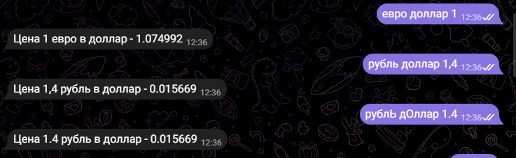

# Telegram-бот «Курсы валют»
## Содержание

- [Описание](#описание)
- [Установка, настройка и запуск](#установка,-настройка-и-запуск)
- [Файловая структура](#файловая-структура)
- [Демонстрация](#демонстрация)

## Стек технологий
- Python 3.8
- pyTelegramBotAPI
- rapidapi (api для получения курса валют)

## Описание

Telegram-бот предоставляет пользователю актуальный на сегодняшний день курс валют рубля, 
доллора и евро. Бот использует **api rapidapi.com** для конвертации валюты.\
Формат команды боту выглядит следующим образом 
`<имя валюты, цену которой хотите узнать> <имя валюты, в которую нужно перевести> <количество переводимой валюты>`
#### Примеры корректных запросов

#### Команды бота
**/start** - запуск бота/помощь по работе с ботом\
**/help** - помощь по работе с ботом\
**/values** - получить информацию о валютах с которыми бот работает

## Установка, настройка и запуск
1. Убедитесь, что у вас установлен python версии 3.8 или выше.
2. Клонируйте этот репозиторий: `https://github.com/SvetlanaKrasnova/telegram_bot_exchange_rates.git`
3. Установить необходимые библиотеки из файла requirements.txt `pip install -r requirements.txt`
4. Заменить файл config на свой. Прописать свой токен бота и ключ от api на сайте rapidapi.com. 
5. Запустите проект: `python main.py`

## Файловая структура
~~~python
telegram_bot_exchange_rates/
├── config/
│   └── config.yaml
├── files/ # Фалы для README.md
├── extensions.py
├── README.md
├── requirements.txt
~~~

## Демонстрация
#### Пример работы с ботом

#### Пример плохих запросов (некорректного обращения к боту)
